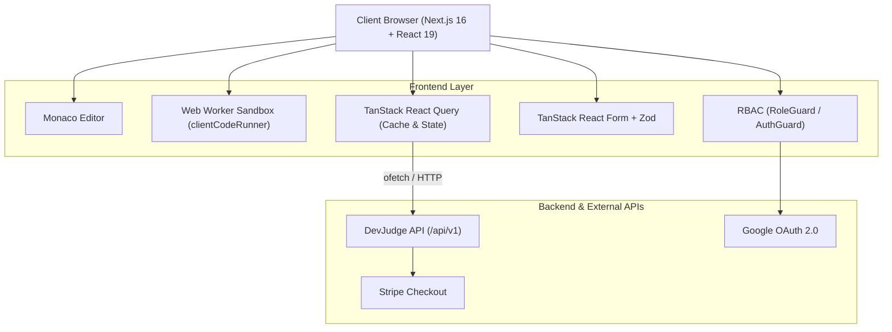

# DevJudge - Technical Assessment & Live Code Judge Platform


**DevJudge** is an enterprise-grade technical hiring and assessment platform built with Next.js (App Router), React 19, and TypeScript. It empowers engineering teams and recruiters to author coding problems, generate timed assessments, evaluate candidate code through an in-browser sandboxed judge, and analyze hiring performance through data-rich scorecards and analytics.

---

## Table of Contents

- [Key Features](#key-features)
- [User Roles & Workflows](#user-roles--workflows)
  - [1. Recruiter](#1-recruiter)
  - [2. Candidate](#2-candidate)
  - [3. Administrator](#3-administrator)
- [Architecture & Tech Stack](#architecture--tech-stack)
- [Project Structure](#project-structure)
- [Live Coding Arena](#live-coding-arena)
- [Getting Started](#getting-started)
  - [Prerequisites](#prerequisites)
  - [Installation](#installation)
  - [Environment Variables](#environment-variables)
  - [Running the App](#running-the-app)
- [Demo Credentials](#demo-credentials)
- [Available Scripts](#available-scripts)
- [Code Quality & Linting](#code-quality--linting)
- [License](#license)

---

## Key Features

- **Live Code Execution Arena**: Monaco Editor integration with multi-language syntax highlighting, starter code templates, automated stdin/stdout test-case verification, and real-time execution metrics (time & memory).
- **Client-Side Judge Sandbox**: Browser Web Worker sandboxing (`clientCodeRunner.ts`) with custom console capture, module isolation, and execution timeouts (preventing infinite loops).
- **Multi-Format Assessments**: Support for both automated **Coding Problems** (with visible samples and hidden judge test cases) and **Multiple Choice Questions (MCQs)**.
- **Assessment Creation Wizard**: 3-step wizard with real-time validation for assessment basics, dynamic problem selection, passing score cutoffs, and review.
- **Candidate Invitation & Results Tracking**: One-click candidate invitations with expiration management, status tracking (Invited, In Progress, Completed, Expired), and detailed submission scorecards.
- **Role-Based Access Control (RBAC)**: Fine-grained route and view protection with `AuthGuard`, `RoleGuard`, and proxy protection for `ADMIN`, `RECRUITER`, and `CANDIDATE` roles.
- **Credit & Billing System**: Integrated subscription tiers and credit packs with Stripe checkout session handling and historical transaction ledger.
- **Platform Analytics**: Interactive Recharts visualizations for system pass rates, revenue generation, candidate performance, and platform KPIs.
- **Resilient Candidate Sessions**: Real-time offline detection banner, countdown timer synchronization, auto-submission on expiry, and unsaved progress guards.
- **Light & Dark Theme**: Flicker-free theme management persisted via `devjudge_theme` localStorage with system preference detection.

---

## User Roles & Workflows

### 1. Recruiter
- **Problem Studio (`/dashboard/recruiter/problems`)**: Create and curate custom coding challenges and MCQs with test cases, point values, memory limits, and time constraints.
- **Assessment Wizard (`/dashboard/recruiter/assessments/create`)**: Assemble multi-problem assessments with time limits (15–240 min) and benchmark passing percentages.
- **Candidate Management (`/dashboard/recruiter/assessments/[id]`)**: Send test invites by email with token expiration dates. Inspect individual candidate code submissions, execution outputs, and overall scores.
- **Billing & Credits (`/dashboard/recruiter/billing`)**: Purchase candidate assessment credits via tiered plans (Starter, Growth, Scale) integrated with Stripe checkout.

### 2. Candidate
- **Candidate Portal (`/dashboard/candidate`)**: Access incoming invitations, active assessments, and previous test history.
- **The Arena (`/arena/[id]`)**: Full-screen, distraction-free assessment environment featuring problem specifications, code editor, sample test runner, and submission controls.
- **Scorecards & Review (`/dashboard/candidate/assessments/[id]/result`)**: Instant post-submission breakdown showing pass/fail status, percentage score, test case results, and submission timestamp.
- **Profile & Skills (`/dashboard/candidate/profile`)**: Manage profile bio, technical skill badges, and social links (GitHub, LinkedIn).

### 3. Administrator
- **Admin Command Center (`/dashboard/admin`)**: High-level platform KPIs (total registered users, total assessments run, global pass rate, gross platform revenue).
- **User Management (`/dashboard/admin/users`)**: Search, paginate, change user roles (Candidate, Recruiter, Admin), and toggle user active/suspended statuses.
- **Global Problem Directory (`/dashboard/admin/problems`)**: Oversee, inspect, edit, or purge all coding problems and tests across the platform.
- **Audit Logs (`/dashboard/admin/audit-logs`)**: Review historical security actions, role changes, and administrative actions with IP addresses and timestamps.

---

## Architecture & Tech Stack



| Layer | Technologies |
| :--- | :--- |
| **Framework** | [Next.js](https://nextjs.org/) 16 (App Router), [React](https://react.dev/) 19 |
| **Language** | [TypeScript](https://www.typescriptlang.org/) (Strict mode) |
| **Styling & UI** | [Tailwind CSS v4](https://tailwindcss.com/), [Lucide React](https://lucide.dev/), `@base-ui/react`, Custom Shadcn-inspired UI |
| **State & Server Cache** | [TanStack React Query v5](https://tanstack.com/query/latest) |
| **Form Handling** | [TanStack React Form](https://tanstack.com/form/latest), [Zod](https://zod.dev/) |
| **Code Editor** | [Monaco Editor](https://microsoft.github.io/monaco-editor/) (`@monaco-editor/react`) |
| **In-Browser Judge** | Web Worker Sandbox with timeout enforcement and stdio capture |
| **HTTP Client** | [ofetch](https://github.com/unjs/ofetch) with automated cookie/credentials handling |
| **Charts & Data Viz** | [Recharts](https://recharts.org/) |
| **Notifications & FX** | [Sonner](https://sonner.emilkowal.ski/), [Canvas Confetti](https://www.npmjs.com/package/canvas-confetti) |
| **Linter & Formatter** | [Biome](https://biomejs.dev/) |

---

## Project Structure

```
├── .env.example                     # Environment configuration template
├── biome.json                       # Biome linter, formatter & import sorting config
├── package.json                     # Dependencies and npm script definitions
├── tsconfig.json                    # Strict TypeScript configuration
└── src/
    ├── api/                         # ofetch client endpoints
    │   ├── admin.api.ts             # Platform stats, users, audit logs
    │   ├── assessment.api.ts        # Assessments CRUD & candidate invites
    │   ├── attempt.api.ts           # Start, submit code, finish & results
    │   ├── auth.api.ts              # Login, register, logout, profile
    │   ├── payment.api.ts           # Stripe checkout & payment history
    │   └── problem.api.ts           # Coding & MCQ problems CRUD
    ├── app/                         # Next.js App Router routes
    │   ├── (public)/                # Landing, about, pricing, problem directory, auth
    │   ├── arena/[id]/              # Live assessment & code editor workspace
    │   ├── dashboard/
    │   │   ├── admin/               # Overview, users, audit logs, problem management
    │   │   ├── candidate/           # Invitations, test history, scorecards, profile
    │   │   └── recruiter/           # Assessments, wizard, candidate submissions, billing
    │   ├── payment/                 # Stripe success & cancellation callbacks
    │   ├── layout.tsx               # Root layout & anti-flicker theme provider
    │   └── page.tsx                 # Public marketing homepage
    ├── assets/                      # Vector SVG assets & logos
    ├── components/                  # Reusable UI component library
    │   ├── admin/                   # KPI cards, pass-rate chart, revenue chart, user table
    │   ├── arena/                   # CodeEditor, ArenaHeader, ProblemStatement, TestResultsPanel
    │   ├── auth/                    # AuthGuard, RoleGuard, DemoLoginCards, GoogleLogin
    │   ├── billing/                 # Credit plans & pricing cards
    │   ├── dashboard/               # DashboardSidebar, DashboardHeader, DashboardShell
    │   ├── forms/                   # AssessmentWizard, ProblemForm, ProfileSettingsForm
    │   │   └── assessment-wizard/   # StepBasics, StepProblems, StepReview, StepIndicator
    │   ├── home/                    # Hero, Features, LiveJudgeDemo
    │   ├── layout/                  # Public Header, Footer
    │   └── ui/                      # Button, Dialog, Sheet, Table, Input, Select, Badge, etc.
    ├── hooks/                       # Custom React Query hooks & business utilities
    ├── lib/                         # Core utility functions
    │   ├── apiClient.ts             # ofetch instance configuration
    │   ├── clientCodeRunner.ts      # Web Worker JavaScript judge runner
    │   └── utils.ts                 # Class merger (cn), date & string formatters
    ├── providers/                   # Context providers (Theme, QueryClient, GoogleOAuth)
    ├── routes/                      # Role-based navigation sidebar declarations
    ├── types/                       # Shared domain TypeScript interfaces
    └── validations/                 # Zod validation schemas for forms & inputs
```

---

## Live Coding Arena

The **Arena** (`src/app/arena/[id]/page.tsx`) provides an isolated environment for candidates during assessments:

```
+----------------------------------------------------------------------------------+
|  DevJudge Arena | Senior Frontend Screen | Time Remaining: 42:15 | [ Finish Test ]|
+----------------------------------------------------------------------------------+
| [ Problem 1 ]  [ Problem 2 ]  [ Problem 3 ]                                      |
+----------------------------------------+-----------------------------------------+
| Problem Statement                      | Monaco Code Editor                      |
|                                        |                                         |
| - Description & Constraints            | function solution(input) {              |
| - Memory & Time Limits                 |   // Candidate writes logic here        |
| - Sample Inputs & Expected Outputs     |   return result;                        |
|                                        | }                                       |
|                                        +-----------------------------------------+
|                                        | Test Cases Panel   [ Run ] [ Submit ]   |
|                                        | - Case 1: Passed (12ms)                 |
|                                        | - Case 2: Passed (8ms)                  |
|                                        | - Case 3 (Hidden): Judge Only           |
+----------------------------------------+-----------------------------------------+
```

- **Execution Safety**: Code execution runs inside an isolated browser Worker. System-level access and DOM manipulations are prevented.
- **Execution Limits**: Configurable timeout (default 2500ms) terminates runaway loops or CPU-intensive execution.
- **Offline Safeguard**: Instant browser network detection alerts the candidate if their connection drops while preserving local edits.
- **Auto-Submission**: When the countdown reaches zero, the system automatically submits the candidate's latest editor state.

---

## Getting Started

### Prerequisites

- **Node.js**: `v20.x` or higher (tested on Node v20+)
- **Package Manager**: `npm`, `pnpm`, or `yarn`

### Installation

1. Clone the repository:
   ```bash
   git clone <repository-url>
   cd assignment-7
   ```

2. Install dependencies:
   ```bash
   npm install
   ```

### Environment Variables

Create a `.env.local` file in the root directory by copying `.env.example`:

```bash
cp .env.example .env.local
```

Configure the following variables:

```env
# Backend API Base URL
NEXT_PUBLIC_API_BASE_URL=https://devjudge.vercel.app/api/v1
NEXT_PUBLIC_API_URL=https://devjudge.vercel.app/api/v1

# Google OAuth Client ID (optional, for Google Sign-in)
NEXT_PUBLIC_GOOGLE_CLIENT_ID=your_google_client_id_here
```

### Running the App

Start the development server:

```bash
npm run dev
```

Open [http://localhost:3000](http://localhost:3000) in your browser.

---

## Demo Credentials

For quick evaluation and testing, the login screen includes **One-Click Demo Login** buttons for all three platform roles:

| Role | Email | Password | Access / Capabilities |
| :--- | :--- | :--- | :--- |
| **Admin** | `admin@devjudge.com` | `Admin@123456` | Full platform control, user management, audit logs, revenue analytics |
| **Recruiter** | `recruiter@techcorp.com` | `Recruiter@123456` | Create assessments, manage problems, invite candidates, buy credits |
| **Candidate** | `candidate@devjudge.com` | `Candidate@123456` | View invitations, take assessments in the Arena, inspect scorecards |

---

## Available Scripts

| Command | Description |
| :--- | :--- |
| `npm run dev` | Starts the Next.js development server at `localhost:3000` |
| `npm run build` | Compiles the production build |
| `npm run start` | Starts the production server |
| `npm run lint` | Runs [Biome](https://biomejs.dev/) to verify lint rules and import ordering |
| `npm run format` | Runs Biome to format code across the repository |

---

## Code Quality & Linting

This codebase uses **Biome** as its primary linter and formatter, configured via `biome.json`.

To run the linter:
```bash
npm run lint
```

To automatically format files:
```bash
npm run format
```

To run TypeScript type checks:
```bash
npx tsc --noEmit
```

---

## License

This project is licensed under the MIT License.
